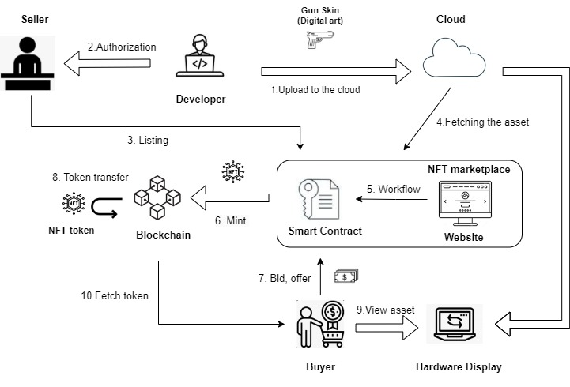

# Gaming Market Place using Blockchain - Solidity Programming
Using the consensus algorithm and ownership asset management of blockchain technology, a solidity program is developed to generate a market place where different collectibles in a game can traded in a virtual marketplace. The program includes the following functionalities - 
1. Adding developer.
2. Adding gamer.
3. Release collectible for sale by owner/developer.
4. Buy available collectible on the market.
5. Put owned collectible on the market for sale.

Collectible for instance can be a gun bundle, gun skin or any in-game objects.
The following depicts the Ecosystem and the Market place structure for the solidity program.

This repository acts a submission for major innovative assignment for the course - Blockchain Technology (DSA - 2CSDE93) while pursuing B.Tech CSE at Nirma University.